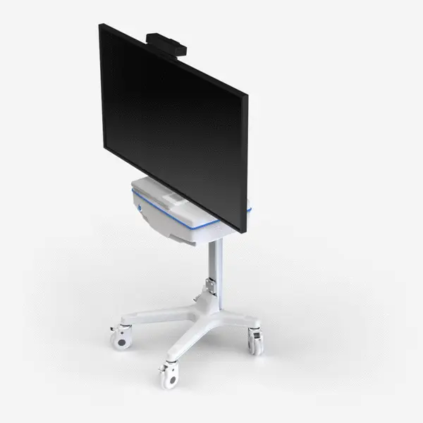

---

## **Назначение**

Система двигательной реабилитации мультисенсорная «Ревимоушен» — это комплекс программных и аппаратных продуктов (далее — ПАК), который предназначен для социальной реабилитации пациентов с двигательными нарушениями.

«Ревимоушен» предназначен для улучшения следующих видов деятельности:

* двигательной активности;
* координации движений верхних и нижних конечностей;
* бытовых навыков;
* навыков самообслуживания.

---

## **Функции и принцип действия**

1. Проведение процесса восстановления во время выполнения комплексов упражнений в игровой форме.
    
    Система оптического трекинга считывает движения пациента и сравнивает с эталонным движением в программе. Когда пациент выполняет движение корректно, персонаж в игровой среде выполняет заданное действие, например, смещается вправо или влево при подъеме рук пациентом. Действия игрового персонажа сопровождаются зрительными и звуковыми эффектами.
    
    В системе представлены различные игровые упражнения. В каждом упражнении доступны следующие настройки:

      * выбор персонажа;
      * вид движения;
      * уровень сложности;
      * количество движений/длительность упражнения.
 
    Такой подход к выполнению упражнений повышает мотивацию, особенно у детей, и увеличивает реабилитационный потенциал.
    
    Достигаемый эффект:

      * увеличение объема движений;
      * улучшение координации движений и баланса;
      * формирование правильных паттернов движений;
      * формирование правильной осанки;
      * увеличение скорости реакций.

2. Проведение диагностики с измерением объема движения в крупных суставах: плечевых, локтевых, тазобедренных и коленных.
   
3. Отображение результатов диагностики в виде графиков и протокола с возможностью отслеживания динамики.
   
4. Учет пациентов — на каждого создается карточка, открывается курс лечения, фиксируются даты посещения и выполненные упражнения.
   
5. Создание шаблонов упражнений.
   
6.  Проведение тестов: Бартела и Тест больших моторных функций GMFM.

---

## **Виды комплетаций**

### ReviMotion Clinic

1. Программное обеспечение на USB-флеш-накопителе
   
2. Стойка, артикул RM1000СL — 1 шт., в составе:
   
      * стойка — 1 шт.;
      * cистемный блок — 1 шт.;
      * кабель питания — 1 шт.;
      * кабель HDMI — 1 шт.;
      * кабель питания телевизора — 1 шт.;
      * кронштейн для крепления телевизора с комплектом для монтажа — 1 шт.
  
3. Телевизор — 1 шт., в составе:
   
      * пульт дистанционного управления — 1шт.;
      * кронштейн для крепления к стойке — 1 шт.;
      * кронштейн для крепления системы оптического трекинга с комплектом для монтажа — 1 шт.

4. Клавиатура компьютерная — 1 шт.
5. Мышь компьютерная — 1 шт. (при необходимости)
6. Система оптического трекинга — 1 шт., варианты исполнения:
      * Кинект Microsoft Kinect V2 — 1 шт., в комплекте:
        * Kinect — 1 шт.;
        * кабель USB 3.0, длина 1,8 м — 1 шт.;
        * кабель питания, длина 1,2 м — 1 шт.;
        * кабель Kinect, длина 3,0 м — 1 шт.;
        * адаптер питания —1 шт.;
        * руководство пользователя — 1 экз.
      * Веб-камера, модель RITMIX RVC-122 — 1 шт., в составе:
        * камера — 1 шт.;
        * кабель-USB 3.0, длина 1,4 м — 1 шт.;
        * инструкция по применению — 1 экз.
7. Руководство по эксплуатации — 1 экз.
8. Паспорт с гарантийным талоном — 1 экз.

  

Внешний вид **ReviMotion Clinic**

---

### ReviMotion Clinic-1

1. Программное обеспечение на USB-флеш-накопителе
2. Ноутбук, модель DELL G5 5590, в составе:

      * ноутбук, 1 шт.
      * кабель питания, длина 1.5 м, 1 шт.
      * адаптер питания, 1 шт.
      * руководство по эксплуатации, 1 экз.

3. Мышь компьютерная — 1 шт. (при необходимости)
4. Система оптического трекинга — 1 шт., варианты исполнения:
      * Кинект Microsoft Kinect V2, 1 шт., в комплекте:
          - Kinect, 1 шт.;
        * кабель USB 3.0, длина 1,8 м, 1 шт.;
        * кабель питания, длина 1,2 м, 1 шт.;
        * кабель Kinect, длина 3,0 м, 1 шт.;
        * адаптер питания, 1 шт.;
        * руководство пользователя, 1 экз.
       * Веб-камера, модель RITMIX RVC-122, 1 шт., в составе:
        * камера, 1 шт.;
        * кабель - USB3.0, длина 1,4 м, 1 шт.;
        * инструкция по применению, 1 экз.
5. Руководство по эксплуатации — 1 экз.
6. Паспорт с гарантийным талоном — 1 экз.

