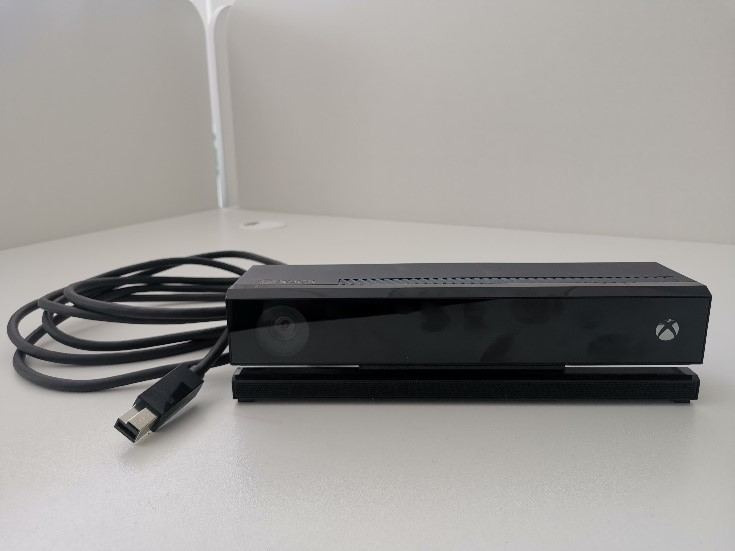
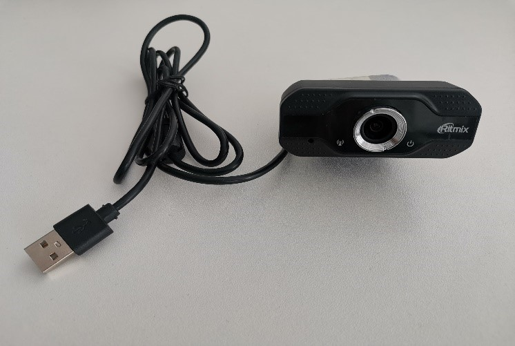

   
   ---

   <html lang="en">
  <head>
    <meta charset="UTF-8" />
    <meta name="viewport" content="width=device-width, initial-scale=1.0" />
    <title>Page Title</title>
    
  </head>
  <body>
    

      <b>Внимание!</b>
      «Всегда проверяйте сетевой кабель на отсутствие даже незначительных повреждений или дефектов. Не используйте поврежденный кабель!
    

  </body>
</html>

1. Зафиксировать положение колёсных опор.
2. Установить телевизор на кронштейн стойки и зафиксировать с помощью болтов.
3. При необходимости отрегулировать наклон телевизора, ослабив болты крепления на кронштейне и затянув их снова в новом положении.
4. Закрепить систему оптического трекинга «Kinect» (рис. 1) на кронштейн над телевизором с помощью болта. При наличии в комплектации веб-камеры (рис. 2) закрепить ее болтом на кронштейне над телевизором.
   

   
**Рисунок 1 — Система оптического трекинга «Kinect»
 
   

   
****Рисунок 2 — Веб-камера**
 
5.	Отрегулировать положение системы оптического трекинга так, чтобы камера была направлена на пациента.
6.	Подключить шнур HDMI, выходящий из верхней части стойки в порт HDMI 1 телевизора.
7.	Подключить шнур питания телевизора, выходящий из верхней части стойки в соответствующий порт телевизора.
8.	Подключить «Ревимоушен» к сети питания 220В.
9. Включить питание клавишей на задней панели системного блока.
10.	Включить «Ревимоушен» кнопкой на передней панели системного блока.
11.	Включить телевизор.
12.	Подключить «Ревимоушен» к сети интернет кабелем UTP в разъем RJ-45 на задней панели системного блока или по Wi-Fi.
