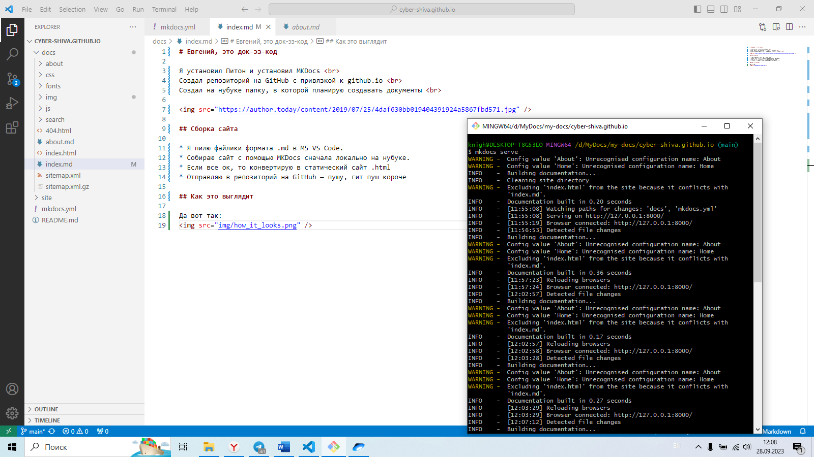

# Евгений, это док-эз-код

Я установил Питон и установил MKDocs  
Создал репозиторий на GitHub с привязкой к github.io  
Создал на нубуке папку, в которой планирую создавать документы  

## Сборка сайта

* Я пилю файлики формата .md в MS VS Code.
* Собираю сайт с помощью MKDocs сначала локально на нубуке.
* Если все ок, то конвертирую в статический сайт .html
* Отправляю в репозиторий на GitHub — пушу, гит пуш короче

## Как это выглядит

Да вот так:
